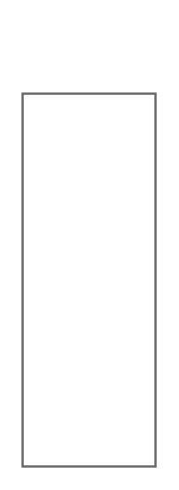

# Horizontal Tab Bar

## Definition

```
{
  _style: 'strokeWidth=1;shadow=0;dashed=0;align=center;html=1;shape=mxgraph.mockup.containers.marginRect2;rectMarginTop=32;strokeColor=#666666;gradientColor=none;whiteSpace=wrap;',
  _width: 0,
  _height: 200,
}
```

## Usage

```
import { HorizontalTabBar } from '@diac/standard-components-diagrams/mockupContainers'

<HorizontalTabBar/>
```

## Preview


