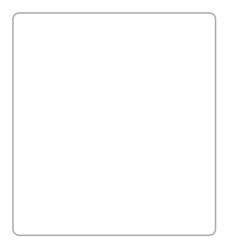

# Calendar

## Definition

```
{
  _style: { 
    entity: 'strokeWidth=1;shadow=0;dashed=0;align=center;html=1;shape=mxgraph.mockup.forms.rrect;rSize=5;strokeColor=#999999;fillColor=#ffffff;',
  },
  _original_width: 160,
  _original_height: 175,
}
```

## Usage

```
import { Calendar } from '@dinghy/standard-components-diagrams/mockupForms'

<Calendar/>
```

## Preview


