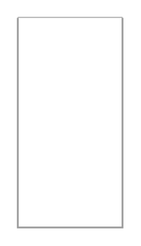

# Checkboxes

## Definition

```
{
  _style: { 
    entity: 'swimlane;strokeColor=#999999;swimlaneFillColor=#FFFFFF;fillColor=#ffffff;fontColor=#666666;fontStyle=0;childLayout=stackLayout;horizontal=1;startSize=0;horizontalStack=0;resizeParent=1;resizeParentMax=0;resizeLast=0;collapsible=0;marginBottom=0;whiteSpace=wrap;html=1;',
  },
  _original_width: 0,
  _original_height: 120,
}
```

## Usage

```
import { Checkboxes } from '@dinghy/standard-components-diagrams/mockupForms'

<Checkboxes/>
```

## Preview


