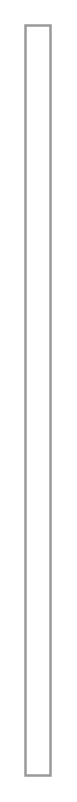

# Email 3

## Definition

```
{
  _style: 'strokeWidth=1;shadow=0;dashed=0;align=center;html=1;shape=mxgraph.mockup.forms.rrect;fillColor=#ffffff;rSize=0;fontColor=#666666;align=left;spacingLeft=3;strokeColor=#999999;verticalAlign=top;whiteSpace=wrap;',
  _width: 10,
  _height: 300,
}
```

## Usage

```
import { Email3 } from '@reactiac/standard-components-diagrams/mockupForms'

<Email3/>
```

## Preview


