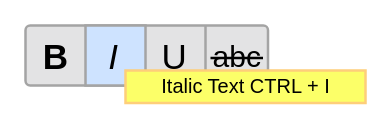

# Formatting Toolbar 1

## Definition

```
{
  _style: { 
    entity: 'verticalLabelPosition=bottom;shadow=0;dashed=0;align=center;html=1;verticalAlign=top;strokeWidth=1;shape=mxgraph.mockup.menus_and_buttons.font_style_selector_1;',
  },
  _width: 136,
  _height: 31,
}
```

## Usage

```
import { FormattingToolbar1 } from '@diac/standard-components-diagrams/mockupForms'

<FormattingToolbar1/>
```

## Preview


