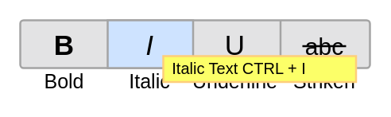

# Formatting Toolbar 3

## Definition

```
{
  _style: { 
    entity: 'verticalLabelPosition=bottom;shadow=0;dashed=0;align=center;html=1;verticalAlign=top;strokeWidth=1;shape=mxgraph.mockup.menus_and_buttons.font_style_selector_3;',
  },
  _original_width: 176,
  _original_height: 38,
}
```

## Usage

```
import { FormattingToolbar3 } from '@dinghy/standard-components-diagrams/mockupForms'

<FormattingToolbar3/>
```

## Preview


