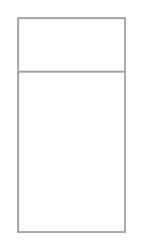

# List Box

## Definition

```
{
  _style: 'swimlane;strokeColor=#999999;swimlaneFillColor=#FFFFFF;fillColor=#ffffff;fontColor=#008CFF;fontStyle=0;childLayout=stackLayout;horizontal=1;startSize=30;horizontalStack=0;resizeParent=1;resizeParentMax=0;resizeLast=0;collapsible=0;marginBottom=0;whiteSpace=wrap;html=1;fontSize=17;',
  _width: 0,
  _height: 120,
}
```

## Usage

```
import { ListBox } from '@diac/standard-components-diagrams/mockupForms'

<ListBox/>
```

## Preview


