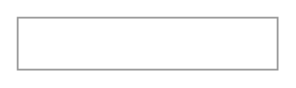

# Password Field

## Definition

```
{
  _style: 'strokeWidth=1;shadow=0;dashed=0;align=center;html=1;shape=mxgraph.mockup.forms.pwField;strokeColor=#999999;mainText=;align=left;fontColor=#666666;fontSize=17;spacingLeft=3;',
  _width: 150,
  _height: 30,
}
```

## Usage

```
import { PasswordField } from '@reactiac/standard-components-diagrams/mockupForms'

<PasswordField/>
```

## Preview


