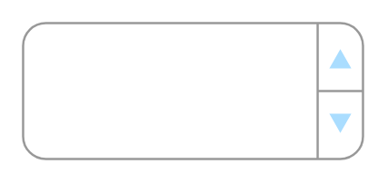

# Spinner

## Definition

```
{
  _style: 'strokeWidth=1;shadow=0;dashed=0;align=center;html=1;shape=mxgraph.mockup.forms.spinner;strokeColor=#999999;spinLayout=right;spinStyle=normal;adjStyle=triangle;fillColor=#aaddff;fontSize=17;fontColor=#666666;mainText=;html=1;overflow=fill;',
  _width: 150,
  _height: 60,
}
```

## Usage

```
import { Spinner } from '@reactiac/standard-components-diagrams/mockupForms'

<Spinner/>
```

## Preview


