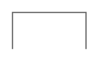

# Wedge Bar

## Definition

```
{
  _style: 'strokeWidth=1;shadow=0;dashed=0;align=center;html=1;shape=mxgraph.mockup.forms.uRect;fontSize=17;fontColor=#666666;align=left;spacingLeft=5;strokeColor=#666666;',
  _width: 0,
  _height: 30,
}
```

## Usage

```
import { WedgeBar } from '@diac/standard-components-diagrams/mockupForms'

<WedgeBar/>
```

## Preview


