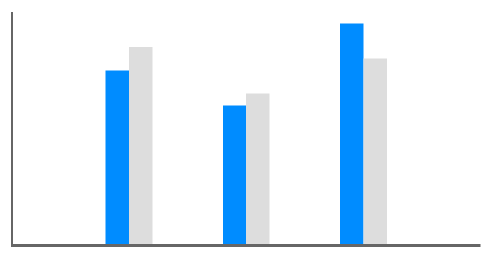

# Column Chart

## Definition

```
{
  _style: 'verticalLabelPosition=bottom;shadow=0;dashed=0;align=center;html=1;verticalAlign=top;strokeWidth=1;shape=mxgraph.mockup.graphics.columnChart;strokeColor=none;strokeColor2=none;strokeColor3=#666666;fillColor2=#008cff;fillColor3=#dddddd;',
  _width: 400,
  _height: 200,
}
```

## Usage

```
import { ColumnChart } from '@diac/standard-components-diagrams/mockupGraphics'

<ColumnChart/>
```

## Preview


