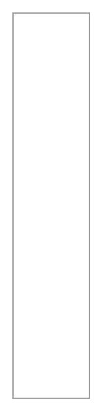

# Gantt Chart

## Definition

```
{
  _style: { 
    entity: 'strokeWidth=1;shadow=0;dashed=0;align=center;html=1;shape=mxgraph.mockup.graphics.rrect;rSize=0;strokeColor=#999999;',
  },
  _original_width: 0,
  _original_height: 300,
}
```

## Usage

```
import { GanttChart } from '@diac/standard-components-diagrams/mockupGraphics'

<GanttChart/>
```

## Preview


