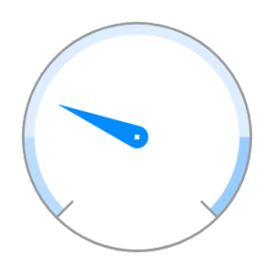

# Gauge

## Definition

```
{
  _style: 'verticalLabelPosition=bottom;shadow=0;dashed=0;align=center;html=1;verticalAlign=top;strokeWidth=1;shape=mxgraph.mockup.graphics.gauge;fillColor=#ffffff;strokeColor=#999999;gaugePos=25;scaleColors=#bbddff,#ddeeff,#99ccff;gaugeLabels=,,;needleColor=#008cff;',
  _width: 100,
  _height: 100,
}
```

## Usage

```
import { Gauge } from '@reactiac/standard-components-diagrams/mockupGraphics'

<Gauge/>
```

## Preview


