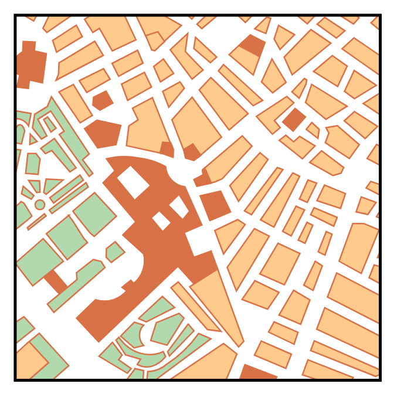

# Map

## Definition

```
{
  _style: { 
    entity: 'verticalLabelPosition=bottom;shadow=0;dashed=0;align=center;html=1;verticalAlign=top;strokeWidth=1;shape=mxgraph.mockup.misc.map;',
  },
  _width: 250,
  _height: 250,
}
```

## Usage

```
import { Map } from '@diac/standard-components-diagrams/mockupGraphics'

<Map/>
```

## Preview


