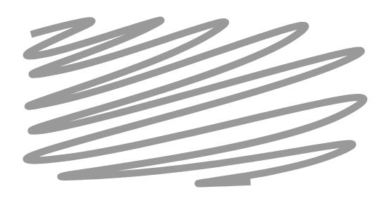

# Scratch Out

## Definition

```
{
  _style: 'shape=mxgraph.mockup.markup.scratchOut;shadow=0;dashed=0;html=1;whiteSpace=wrap;strokeColor=#999999;strokeWidth=4;',
  _width: 200,
  _height: 100,
}
```

## Usage

```
import { ScratchOut } from '@reactiac/standard-components-diagrams/mockupMarkup'

<ScratchOut/>
```

## Preview


