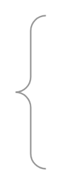

# Vertical Curly Brace

## Definition

```
{
  _style: { 
    entity: 'labelPosition=right;align=left;strokeWidth=1;shape=mxgraph.mockup.markup.curlyBrace;html=1;shadow=0;dashed=0;strokeColor=#999999;direction=north;',
  },
  _original_width: 20,
  _original_height: 100,
}
```

## Usage

```
import { VerticalCurlyBrace } from '@diac/standard-components-diagrams/mockupMarkup'

<VerticalCurlyBrace/>
```

## Preview


