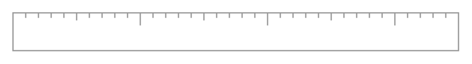

# Horizontal Ruler 2

## Definition

```
{
  _style: { 
    entity: 'strokeWidth=1;shadow=0;dashed=0;align=center;html=1;shape=mxgraph.mockup.misc.ruler2;dx=100;rulerOrient=up;unitSize=10;fontColor=#999999;spacingLeft=96;align=left;verticalAlign=middle;spacingBottom=0;spacingTop=10;spacingRight=0;spacing=0;strokeColor=#999999;',
  },
  _original_width: 350,
  _original_height: 30,
}
```

## Usage

```
import { HorizontalRuler2 } from '@diac/standard-components-diagrams/mockupMisc'

<HorizontalRuler2/>
```

## Preview


