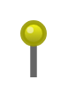

# Pin 4

## Definition

```
{
  _style: 'verticalLabelPosition=top;shadow=0;dashed=0;align=center;html=1;verticalAlign=bottom;strokeWidth=1;shape=mxgraph.mockup.misc.pin;fillColor2=#ffff00;fillColor3=#888800;strokeColor=#999900;',
  _width: 10,
  _height: 25,
}
```

## Usage

```
import { Pin4 } from '@reactiac/standard-components-diagrams/mockupMisc'

<Pin4/>
```

## Preview


