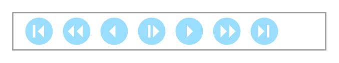

# Playback Controls

## Definition

```
{
  _style: 'verticalLabelPosition=bottom;shadow=0;dashed=0;align=center;html=1;verticalAlign=top;strokeWidth=1;shape=mxgraph.mockup.misc.playbackControls;sketch=0;strokeColor=#999999;fillColor2=#99ddff;strokeColor2=none;fillColor3=#ffffff;strokeColor3=none;',
  _width: 250,
  _height: 30,
}
```

## Usage

```
import { PlaybackControls } from '@diac/standard-components-diagrams/mockupMisc'

<PlaybackControls/>
```

## Preview


