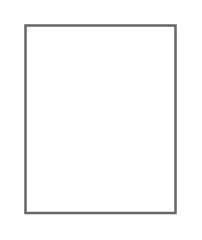

# Revision Table

## Definition

```
{
  _style: { 
    entity: 'strokeWidth=1;shadow=0;dashed=0;align=center;html=1;shape=mxgraph.mockup.misc.rrect;rSize=0;strokeColor=#666666;',
  },
  _width: 0,
  _height: 75,
}
```

## Usage

```
import { RevisionTable } from '@diac/standard-components-diagrams/mockupMisc'

<RevisionTable/>
```

## Preview


