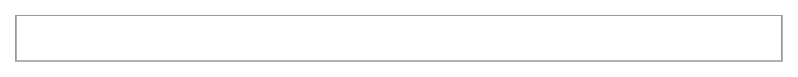

# Status Bar

## Definition

```
{
  _style: 'strokeWidth=1;shadow=0;dashed=0;align=center;html=1;shape=mxgraph.mockup.misc.rrect;rSize=0;strokeColor=#999999;fillColor=#ffffff;',
  _width: 500,
  _height: 30,
}
```

## Usage

```
import { StatusBar } from '@reactiac/standard-components-diagrams/mockupMisc'

<StatusBar/>
```

## Preview


