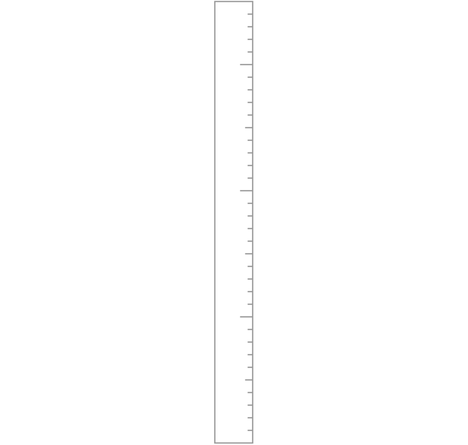

# Vertical Ruler

## Definition

```
{
  _style: 'strokeWidth=1;shadow=0;dashed=0;align=center;html=1;shape=mxgraph.mockup.misc.ruler2;dx=100;rulerOrient=down;unitSize=10;fontColor=#999999;spacingLeft=96;align=left;verticalAlign=middle;spacingBottom=10;spacingTop=0;spacingRight=0;rotation=-90;spacing=0;strokeColor=#999999;',
  _width: 350,
  _height: 30,
}
```

## Usage

```
import { VerticalRuler } from '@diac/standard-components-diagrams/mockupMisc'

<VerticalRuler/>
```

## Preview


