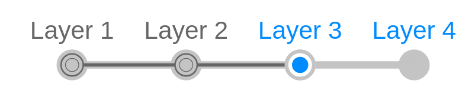

# Step Bar 2

## Definition

```
{
  _style: 'strokeWidth=1;shadow=0;dashed=0;align=center;html=1;shape=mxgraph.mockup.navigation.stepBar;strokeColor=#c4c4c4;textColor=#666666;textColor2=#008cff;mainText=Layer 1,Layer 2,+Layer 3,Layer 4;textSize=17;fillColor=#666666;overflow=fill;fontSize=17;fontColor=#666666;',
  _width: 300,
  _height: 50,
}
```

## Usage

```
import { StepBar2 } from '@reactiac/standard-components-diagrams/mockupNavigation'

<StepBar2/>
```

## Preview


