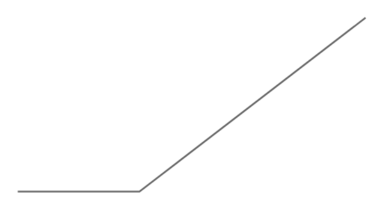

# Callout 3

## Definition

```
{
  _style: { 
    entity: 'strokeWidth=1;shadow=0;dashed=0;align=center;html=1;shape=mxgraph.mockup.text.callout;linkText=;textSize=17;textColor=#666666;callDir=SW;callStyle=line;fontSize=17;fontColor=#666666;align=left;verticalAlign=bottom;strokeColor=#666666;',
  },
  _original_width: 200,
  _original_height: 100,
}
```

## Usage

```
import { Callout3 } from '@diac/standard-components-diagrams/mockupText'

<Callout3/>
```

## Preview


