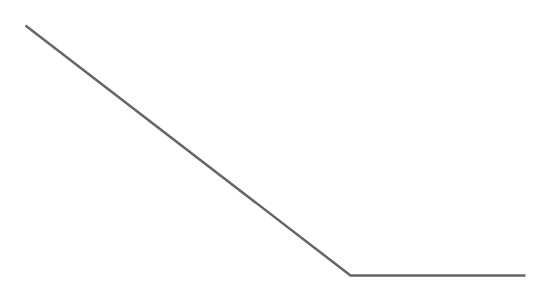

# Callout 4

## Definition

```
{
  _style: 'strokeWidth=1;shadow=0;dashed=0;align=center;html=1;shape=mxgraph.mockup.text.callout;linkText=;textSize=17;textColor=#666666;callDir=SE;callStyle=line;fontSize=17;fontColor=#666666;align=right;verticalAlign=bottom;strokeColor=#666666;',
  _width: 200,
  _height: 100,
}
```

## Usage

```
import { Callout4 } from '@reactiac/standard-components-diagrams/mockupText'

<Callout4/>
```

## Preview


