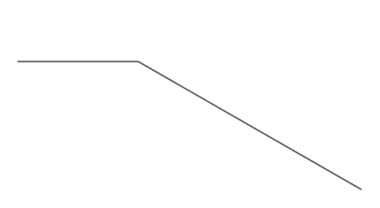

# Callout

## Definition

```
{
  _style: 'strokeWidth=1;shadow=0;dashed=0;align=center;html=1;shape=mxgraph.mockup.text.callout;linkText=;textSize=17;textColor=#666666;callDir=NW;callStyle=line;fontSize=17;fontColor=#666666;align=left;verticalAlign=top;strokeColor=#666666;',
  _width: 200,
  _height: 100,
}
```

## Usage

```
import { Callout } from '@reactiac/standard-components-diagrams/mockupText'

<Callout/>
```

## Preview


