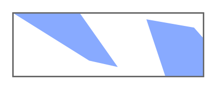

# Captcha

## Definition

```
{
  _style: 'strokeWidth=1;shadow=0;dashed=0;align=center;html=1;shape=mxgraph.mockup.text.captcha;fontColor=#666666;fontSize=25;strokeColor=#666666;mainText=',
  _width: 150,
  _height: 50,
}
```

## Usage

```
import { Captcha } from '@diac/standard-components-diagrams/mockupText'

<Captcha/>
```

## Preview


