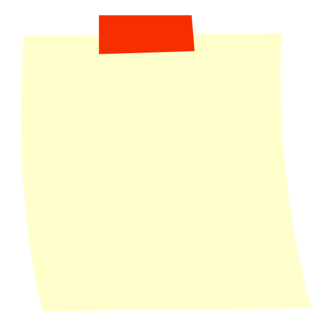

# Sticky Note

## Definition

```
{
  _style: { 
    entity: 'strokeWidth=1;shadow=0;dashed=0;align=center;html=1;shape=mxgraph.mockup.text.stickyNote2;fontColor=#666666;mainText=;fontSize=17;whiteSpace=wrap;fillColor=#ffffcc;strokeColor=#F62E00;',
  },
  _original_width: 200,
  _original_height: 200,
}
```

## Usage

```
import { StickyNote } from '@dinghy/standard-components-diagrams/mockupText'

<StickyNote/>
```

## Preview


