# Software Sitemap Entities

- [AboutUs](./about-us.md)  

- [Audio](./audio.md)  

- [Biography](./biography.md)  

- [Blog](./blog.md)  

- [Calendar](./calendar.md)  
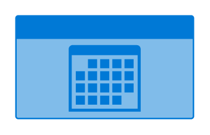

- [Chart](./chart.md)  
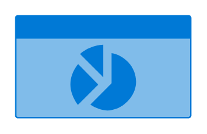

- [Chat](./chat.md)  

- [Cloud](./cloud.md)  
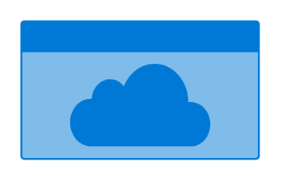

- [Contact](./contact.md)  

- [ContactUs](./contact-us.md)  

- [Document](./document.md)  
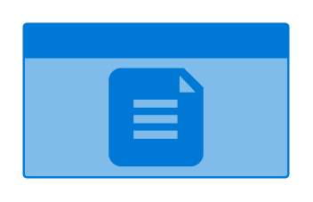

- [Download](./download.md)  
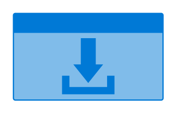

- [Error](./error.md)  
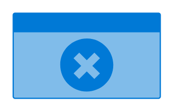

- [Faq](./faq.md)  

- [Form](./form.md)  
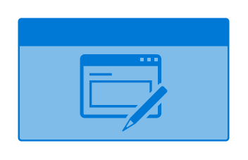

- [Gallery](./gallery.md)  
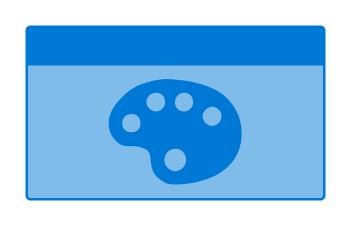

- [Game](./game.md)  
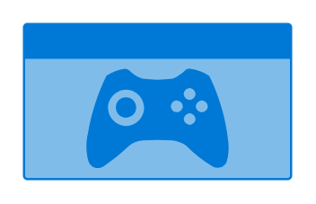

- [Home](./home.md)  
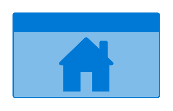

- [Info](./info.md)  
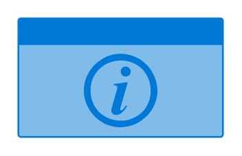

- [Jobs](./jobs.md)  
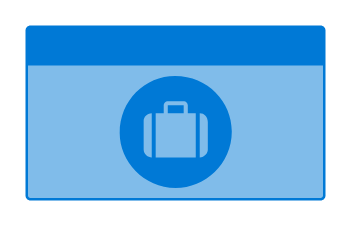

- [Log](./log.md)  

- [Login](./login.md)  

- [Mail](./mail.md)  

- [Map](./map.md)  

- [News](./news.md)  

- [Page](./page.md)  

- [Payment](./payment.md)  
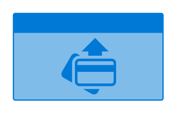

- [Photo](./photo.md)  
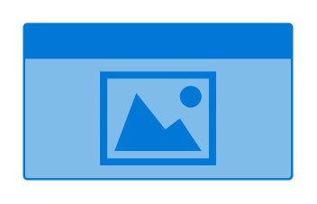

- [Portfolio](./portfolio.md)  

- [Post](./post.md)  

- [Pricing](./pricing.md)  

- [Print](./print.md)  
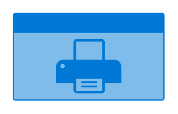

- [Products](./products.md)  
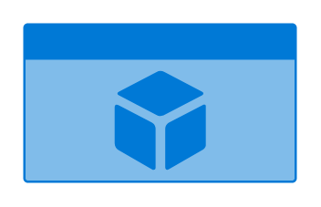

- [Profile](./profile.md)  

- [References](./references.md)  
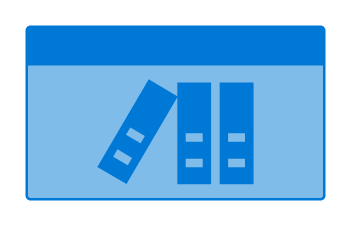

- [Script](./script.md)  

- [Search](./search.md)  

- [Security](./security.md)  

- [Services](./services.md)  
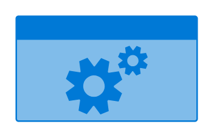

- [Settings](./settings.md)  
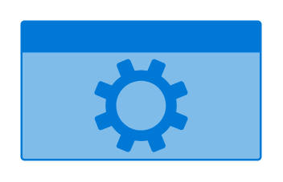

- [Shopping](./shopping.md)  

- [Sitemap](./sitemap.md)  
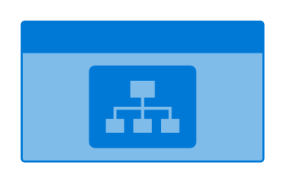

- [Slideshow](./slideshow.md)  
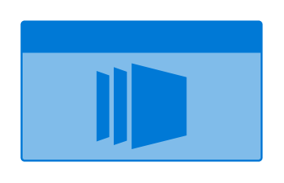

- [Sports](./sports.md)  
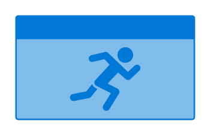

- [Success](./success.md)  
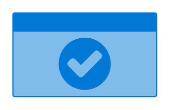

- [Text](./text.md)  

- [Upload](./upload.md)  
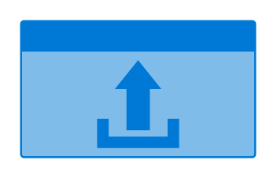

- [User](./user.md)  

- [Video](./video.md)  

- [Warning](./warning.md)  
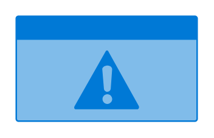
