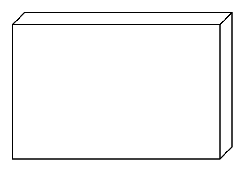

# Block

## Definition

```
{
  _style: { 
    entity: 'verticalAlign=top;align=left;spacingTop=8;spacingLeft=2;spacingRight=12;shape=cube;size=10;direction=south;fontStyle=4;html=1;whiteSpace=wrap;',
  },
  _original_width: 180,
  _original_height: 120,
}
```

## Usage

```
import { Block } from '@dinghy/standard-components-diagrams/uml'

<Block/>
```

## Preview


