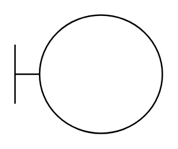

# Boundary Object

## Definition

```
{
  _style: 'shape=umlBoundary;whiteSpace=wrap;html=1;',
  _width: 100,
  _height: 80,
}
```

## Usage

```
import { BoundaryObject } from '@reactiac/standard-components-diagrams/uml'

<BoundaryObject/>
```

## Preview


