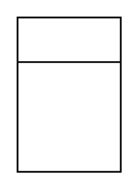

# Class

## Definition

```
{
  _style: 'swimlane;fontStyle=1;align=center;verticalAlign=top;childLayout=stackLayout;horizontal=1;startSize=26;horizontalStack=0;resizeParent=1;resizeParentMax=0;resizeLast=0;collapsible=1;marginBottom=0;whiteSpace=wrap;html=1;',
  _width: 0,
  _height: 90,
}
```

## Usage

```
import { Class } from '@reactiac/standard-components-diagrams/uml'

<Class/>
```

## Preview


