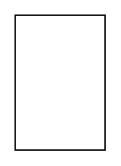

# Component with Attributes

## Definition

```
{
  _style: 'align=left;overflow=fill;html=1;dropTarget=0;whiteSpace=wrap;',
  _width: 0,
  _height: 90,
}
```

## Usage

```
import { ComponentWithAttributes } from '@reactiac/standard-components-diagrams/uml'

<ComponentWithAttributes/>
```

## Preview


