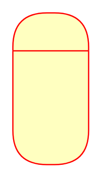

# Composite State

## Definition

```
{
  _style: { 
    entity: 'swimlane;fontStyle=1;align=center;verticalAlign=middle;childLayout=stackLayout;horizontal=1;startSize=30;horizontalStack=0;resizeParent=0;resizeLast=1;container=0;fontColor=#000000;collapsible=0;rounded=1;arcSize=30;strokeColor=#ff0000;fillColor=#ffffc0;swimlaneFillColor=#ffffc0;dropTarget=0;',
  },
  _original_width: 0,
  _original_height: 120,
}
```

## Usage

```
import { CompositeState } from '@dinghy/standard-components-diagrams/uml'

<CompositeState/>
```

## Preview


