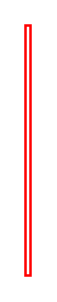

# Condition 3

## Definition

```
{
  _style: { 
    entity: 'edgeStyle=orthogonalEdgeStyle;html=1;align=left;verticalAlign=top;endArrow=open;endSize=8;strokeColor=#ff0000;',
  },
  _original_width: 2,
  _original_height: 100,
}
```

## Usage

```
import { Condition3 } from '@dinghy/standard-components-diagrams/uml'

<Condition3/>
```

## Preview


