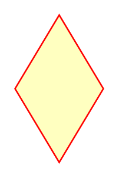

# Condition

## Definition

```
{
  _style: { 
    entity: 'rhombus;whiteSpace=wrap;html=1;fontColor=#000000;fillColor=#ffffc0;strokeColor=#ff0000;',
  },
  _original_width: 0,
  _original_height: 100,
}
```

## Usage

```
import { Condition } from '@dinghy/standard-components-diagrams/uml'

<Condition/>
```

## Preview


