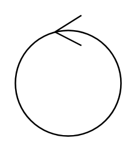

# Control Object

## Definition

```
{
  _style: { 
    entity: 'ellipse;shape=umlControl;whiteSpace=wrap;html=1;',
  },
  _width: 70,
  _height: 80,
}
```

## Usage

```
import { ControlObject } from '@diac/standard-components-diagrams/uml'

<ControlObject/>
```

## Preview


