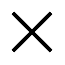

# Destruction

## Definition

```
{
  _style: 'shape=umlDestroy;whiteSpace=wrap;html=1;strokeWidth=3;targetShapes=umlLifeline;',
  _width: 30,
  _height: 30,
}
```

## Usage

```
import { Destruction } from '@reactiac/standard-components-diagrams/uml'

<Destruction/>
```

## Preview


