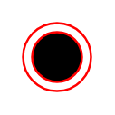

# End

## Definition

```
{
  _style: { 
    entity: 'ellipse;html=1;shape=endState;fillColor=#000000;strokeColor=#ff0000;',
  },
  _original_width: 30,
  _original_height: 30,
}
```

## Usage

```
import { End } from '@dinghy/standard-components-diagrams/uml'

<End/>
```

## Preview


