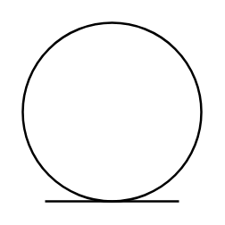

# Entity Object

## Definition

```
{
  _style: 'ellipse;shape=umlEntity;whiteSpace=wrap;html=1;',
  _width: 60,
  _height: 60,
}
```

## Usage

```
import { EntityObject } from '@diac/standard-components-diagrams/uml'

<EntityObject/>
```

## Preview


