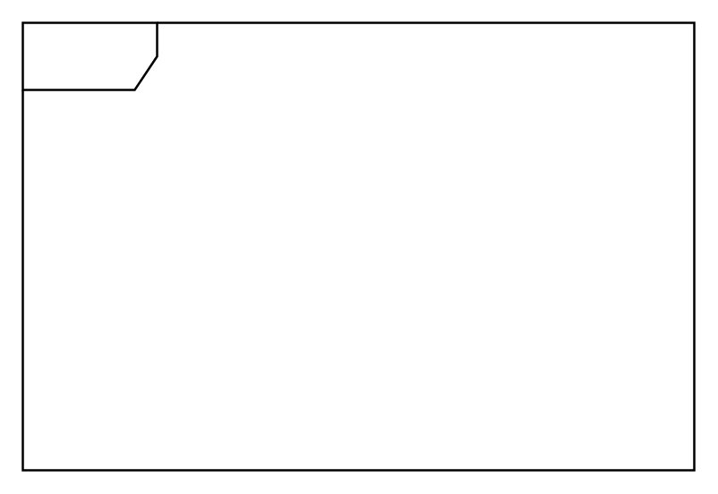

# Frame

## Definition

```
{
  _style: 'shape=umlFrame;whiteSpace=wrap;html=1;pointerEvents=0;',
  _width: 300,
  _height: 200,
}
```

## Usage

```
import { Frame } from '@diac/standard-components-diagrams/uml'

<Frame/>
```

## Preview


