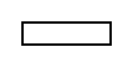

# Lollipop Notation

## Definition

```
{
  _style: { 
    entity: 'rounded=0;orthogonalLoop=1;jettySize=auto;html=1;endArrow=halfCircle;endFill=0;endSize=6;strokeWidth=1;sketch=0;',
  },
  _width: 40,
  _height: 10,
}
```

## Usage

```
import { LollipopNotation } from '@diac/standard-components-diagrams/uml'

<LollipopNotation/>
```

## Preview


