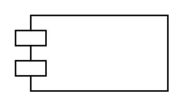

# Module

## Definition

```
{
  _style: 'shape=module;align=left;spacingLeft=20;align=center;verticalAlign=top;whiteSpace=wrap;html=1;',
  _width: 100,
  _height: 50,
}
```

## Usage

```
import { Module } from '@diac/standard-components-diagrams/uml'

<Module/>
```

## Preview


