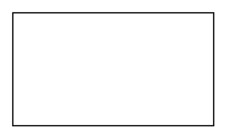

# Object 2

## Definition

```
{
  _style: { 
    entity: 'verticalAlign=top;align=left;overflow=fill;html=1;whiteSpace=wrap;',
  },
  _original_width: 160,
  _original_height: 90,
}
```

## Usage

```
import { Object2 } from '@diac/standard-components-diagrams/uml'

<Object2/>
```

## Preview


