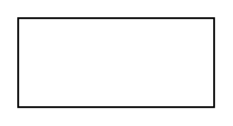

# Object

## Definition

```
{
  _style: 'html=1;whiteSpace=wrap;',
  _width: 110,
  _height: 50,
}
```

## Usage

```
import { Object } from '@diac/standard-components-diagrams/uml'

<Object/>
```

## Preview


