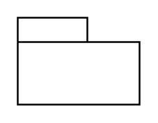

# Package

## Definition

```
{
  _style: 'shape=folder;fontStyle=1;spacingTop=10;tabWidth=40;tabHeight=14;tabPosition=left;html=1;whiteSpace=wrap;',
  _width: 70,
  _height: 50,
}
```

## Usage

```
import { Package } from '@diac/standard-components-diagrams/uml'

<Package/>
```

## Preview


