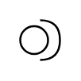

# Provided/Required Interface

## Definition

```
{
  _style: { 
    entity: 'shape=providedRequiredInterface;html=1;verticalLabelPosition=bottom;sketch=0;',
  },
  _width: 20,
  _height: 20,
}
```

## Usage

```
import { ProvidedRequiredInterface } from '@diac/standard-components-diagrams/uml'

<ProvidedRequiredInterface/>
```

## Preview


