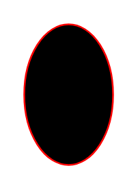

# Start

## Definition

```
{
  _style: { 
    entity: 'ellipse;html=1;shape=startState;fillColor=#000000;strokeColor=#ff0000;',
  },
  _original_width: 0,
  _original_height: 90,
}
```

## Usage

```
import { Start } from '@diac/standard-components-diagrams/uml'

<Start/>
```

## Preview


