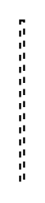

# Synchronous Invocation 2

## Definition

```
{
  _style: { 
    entity: 'html=1;verticalAlign=bottom;endArrow=open;dashed=1;endSize=8;curved=0;rounded=0;exitX=0;exitY=1;exitDx=0;exitDy=-5;',
  },
  _original_width: 2,
  _original_height: 80,
}
```

## Usage

```
import { SynchronousInvocation2 } from '@dinghy/standard-components-diagrams/uml'

<SynchronousInvocation2/>
```

## Preview


