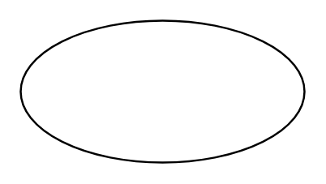

# Use Case

## Definition

```
{
  _style: { 
    entity: 'ellipse;whiteSpace=wrap;html=1;',
  },
  _original_width: 140,
  _original_height: 70,
}
```

## Usage

```
import { UseCase } from '@diac/standard-components-diagrams/uml'

<UseCase/>
```

## Preview


